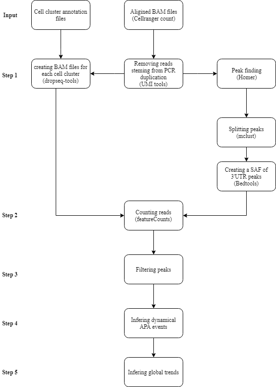
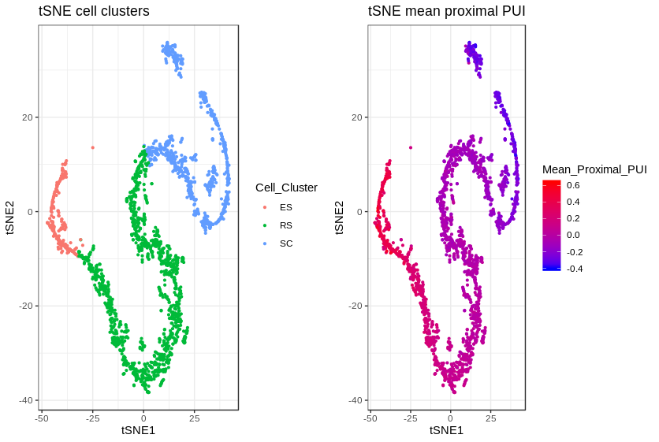

scAPA
================

This is a package and a shell script for alternative polyadenylation (APA) analysis of 3' tag single-cell RNA-seq data. The shell script "scAPAscript.R" takes as input BAM files generated by aligned using 10x 3' tag RNA seq pipline and the results of cell clustering.

Prerequisites
=============

### Files

-   Fasta and chromosome length files for human (hg19) or (and) mouse (mm10). Can be downloaded from [UCSC website](http://hgdownload.cse.ucsc.edu/goldenPath/mm10/bigZips/)

### Tools

-   [Samtools](http://www.htslib.org/download/) version 0.1.19-96b5f2294a or above.
-   [Bedtools](https://bedtools.readthedocs.io/en/latest/content/installation.html) version v2.27.1-17-gf59480f or above.
-   [Homer](http://homer.ucsd.edu/homer/introduction/install.html) version v4.8.3 or above. Uses Homer's "MakeTagdirectory" and "findPeaks".
-   [UMI\_tools](https://github.com/CGATOxford/UMI-tools/blob/master/doc/QUICK_START.md)
-   [Drop-seq\_tools-2.2.0](https://github.com/broadinstitute/Drop-seq/releases/tag/v2.2.0)
-   R version 3.5.3, or above.
-   Optional: [ChangePoint](https://sourceforge.net/projects/utr/files/), version 0.1.1

### R packages

-   Install the following: dplyr, plyr, tidyr, ggplot2, EnvStats, parallel, devtools, Rsubread (a Bioconductor package).

If the above packages are installed in a library other than your default R library, specify the path to the alternative library when running the script (-loc = path/to/Rlibrary/).

Installing
==========

-   Install all the above.
-   Install scAPA package. In R:

``` r
devtools::install_github("ElkonLab/scAPA/scAPA")
```

-   Install the package Rsubread:
-   Download scAPA.shell.script folder. Or use:

<!-- -->

    git clone https://github.com/ElkonLab/scAPA.git

-   Open configfile.txt in scAPA.shell.script folder. Fill in the paths to the fasta files, chromosome length files, and all the tools as instructed in the file. Leave "PATH" if the tool is in your PATH environment variable. Save your changes.

Using scAPA shell script
========================

Input Files
-----------

For an example of input files, see the example below. Put in one directory the following files and only these files:

**1. 3' tag single-cell RNA seq BAM files**

BAM files generated by 10x 3' tag RNA seq pipline (aligned using cellranger). Cell barcode is CB, and the molecular barcode is UB. The name of each BAM file should be of the following format: sample.name.bam. Avoid underscores in the names.

**2. Cluster annotations**

Tab-delimited two-column files with no header. The first column is the cell barcodes (CB). The second is the cluster assigned to the cell. Each file corresponds to a sample (BAM). Notice that the cell barcodes are the same as in the BAM. For example, if the end of the barcode in the BAM file is "-1", it should be the same in the text file. The names of the files should be of the following format: clusters\_sample.name.txt, where the sample names match those of the BAM files.

Usage
-----

Run the script as follow:

    Rscript scAPA.shell.script.R -p <path.to.files> -org <organism> -sp <path.to.script.dir> [options]

&lt;path.to.files&gt; is the path to the directory with BAM and cluster annotations text files. Do not add / in the end of the path. -org The organism is either Mm for a mouse (mm10) or Hs for human (hg19). &lt;path.to.script.dir&gt; is the path to the scAPA.shell.script directory. For a list of options view the [Options.md](Options.md) file, or type:

    Rscript scAPA.shell.script.R --help

The shell script performs all the following steps:



For details regarding the individual steps, see [pipeline.description.pdf](pipeline.description.pdf). For manual implementation of our pipeline, see [Instructions.manual.pipline.md](Instructions.manual.pipline.md) and package [vignette](scAPA_vignette.md).

Example for usage
-----------------

The files used for this example are from [Lukassen et al](https://www.ncbi.nlm.nih.gov/pmc/articles/PMC6132189/). The original fastq files can be obtined from [GSE104556](https://www.ncbi.nlm.nih.gov/geo/query/acc.cgi?acc=GSE104556). **Please notice that the BAM files provided here have been downsampled, to contain 25% of the reads.** The result will differ from the results obtained from analyzing the full BAM files. Downlad the folder down.sampled.spermatogenesis from [this link](https://drive.google.com/open?id=1xK7lR2ECfJ-Cjb1f4bYnaA5JjYtdqrGA). After downloading and configuring scAPA.sell.script.R, use the following command:

    Rscript scAPA.shell.script.R -p path/to/down.sampled.spermatogenesis -org Mm -sp path/to/scAPA.shell.script

By default, the script counts reads at a single-cell level. For faster analysis, count reads from cell clusters by using the "-sc false" option. The default number of cores to use is set to 30.

### Estimated Run Time

Running the script on the example files with 30 cores, took approximately 14 hours. Bellow are estimated times (30 cores) for each step of the analysis:

-   **Step 1a** PCR duplicates removal: ~2 hours and 30 minutes.
-   **Step 1b** Peak detection: ~45 minetes
-   **Step 1c** Separating Peaks: ~3 hours.
-   **Step 2** Quantifying the usage of each peak: ~4 hours.
-   **Step 3** Peak filtering: ~20 minutes.
-   **Step 4** Statistical analysis: ~5 minutes.
-   **Step 5** Inferring global trends: ~3 hours.

Output Files
------------

For a full list of output files and their description, see the file [outputs.md](outputs.md). The following is a partial list of outputs:

-   **summary.UTR.txt (summary.Introns.txt)** A short summary of the 3'UTR peak analysis.

-   **ThreeUTR.peaks.txt (Intron.peaks.txt)** The 3'UTR peaks that passed filtering. The file contains the peak ID, gene symbol, ensemble ID, and genomic location.

-   **APA.events.txt** For 3'UTRs with more than one peak, gives the p-value, FDR corrected q-value of APA events tested across the clusters. Also given is the proximal PUI index in each cell cluster.

-   **UTRs.with.multiple.peaks.txt** a file containing the results of testing the differential usage of individual peaks across clusters. Only peaks from 3'UTR with more than 2 peaks that came up significant in the analysis are analyzed in this step. The file contains tables for each 3'UTR. The p-value and FDR q-value for each peak (from chi-square test for goodness of fit) are given. The peak usage index (PUI) for each cluster is given. Higher PUI in a cluster means higher usage of the peak in the cluster.

-   **Mean.Cell.PPUI.txt** gives the mean proximal PUI index for the cells analyzed.

-   **Peak.RDS** an R object of the unfiltered counts. Can be load in R and analyzed using scAPA package.



For producing such plots, see package [vignette](scAPA_vignette.md).

Log files
---------

The script's logfile scAPA.script.log is created in scAPA directory. A directory Log.files is created containing the log files from the tools used (such as UMI tools).

Authors
=======

-   Eldad Shulman
-   Dr. Ran Elkon

License
=======

This project is licensed under the BSD 3 License - see the [LICENSE.md](LICENSE.md) file for details
