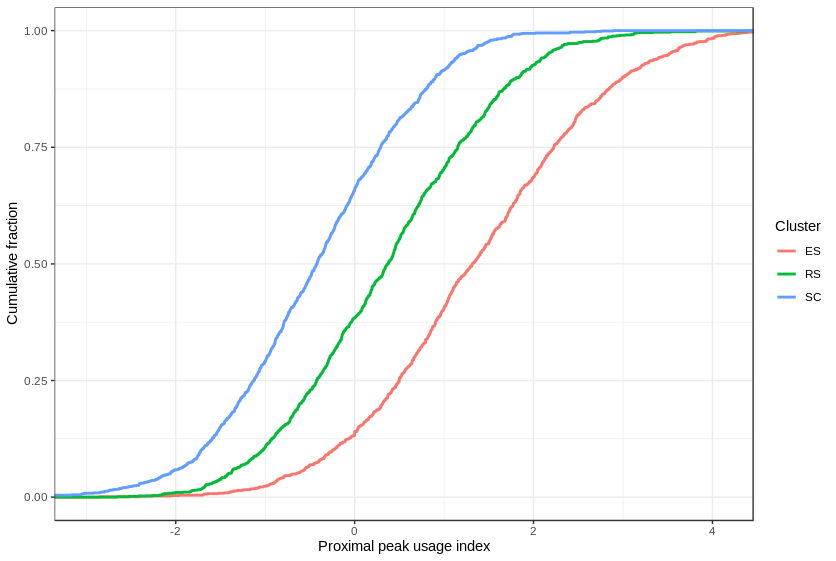

scAPA packege vignette
================

Install and load scAPA package.

    ## Loading required package: devtools

    ## Loading required package: usethis

    ## Loading required package: scAPA

The files used for this example are the results of scAPA analysis of data from [Lukassen et al](https://www.ncbi.nlm.nih.gov/pmc/articles/PMC6132189/).

This **is not** a downsampled version, but an analysis of the full bams. Load scAPAList object.

``` r
a <- readRDS("Peaks.RDS")
a
```

    ## an scAPA object
    ## 
    ## # peaks:  20687 
    ## # cells:  2042 
    ## clusters:     RS ES SC 
    ## 
    ##  Clusters counts were not calculated yet.

The object contains the following:

-   The peak count matrix:

``` r
head(a@cells.counts[,1:3])
```

    ##                     Peak_ID SRR6129050_AAACCTGAGCTTATCG-1
    ## 1  ENSMUSG00000000001.4_1_1                             0
    ## 2  ENSMUSG00000000001.4_1_2                             0
    ## 3 ENSMUSG00000000028.15_1_1                             0
    ## 4 ENSMUSG00000000037.16_2_1                             0
    ## 5 ENSMUSG00000000037.16_2_2                             0
    ## 6 ENSMUSG00000000049.11_1_1                             0
    ##   SRR6129050_AAACCTGGTTGAGTTC-1
    ## 1                             0
    ## 2                             0
    ## 3                             0
    ## 4                             0
    ## 5                             0
    ## 6                             0

rows are peaks, and columns are cell clusters.

-   Cell-cluster annotions.

``` r
head(a@cluster.anot)
```

    ##                         Cell_BC Cell_Cluster     TSNE-1     TSNE-2
    ## 1 SRR6129050_AAACCTGAGCTTATCG-1           RS   1.138438 -32.931800
    ## 2 SRR6129050_AAACCTGGTTGAGTTC-1           RS   6.849414 -34.013543
    ## 3 SRR6129050_AAACCTGTCAACGAAA-1           RS -23.578904 -13.438399
    ## 4 SRR6129050_AAACGGGCACAGGTTT-1           RS -26.702202 -11.977982
    ## 5 SRR6129050_AAACGGGTCATTTGGG-1           ES -40.309965  -8.694377
    ## 6 SRR6129050_AAACGGGTCCTCATTA-1           ES -41.710761  -4.112366

The first column is the cell barcodes as it appears in the peak count matrix. The second is their assigned cell clusters. Other columns, such as the tsne coordinates, are optional.

-   A data.frame with the sequence downstream the 3' edge of each peak:

``` r
head(a@down.seq,2)
```

    ##                    Peak_ID
    ## 1 ENSMUSG00000000001.4_1_1
    ## 2 ENSMUSG00000000001.4_1_2
    ##                                                                                                                                                                                             Downstream_Seq
    ## 1 TGGTTATTGGGACTATATTAATAGAGCTTTTCGGAATGAAATTTATGTTACTGTCATGTTTAAAGTACCACAATGGTTTCTAAACAGCATTCACCTTGGAGAGTTCTACAGTACGATTCCTGCTCTCATTGCTTTACGCTTACGGTTGGAAGTTGTATTTGTCGGGGTTAACCTTGTTTGTGCTGATTACCAAATTACTA
    ## 2 TTTTAAACCTTTCTGTTAATTAAAAATAGAAGTTCTTCACTTCTTTGTCTCTGCACACCACTTTTATTTGTCTTGTTTTTACATGAAATCATTCTTACCTTACCATCCAGGTTCCTTCCTTTAGAAGTCCCCCAAAGTCTGAAGACGATGTTTCTTTCCTGGTGGGCCTTTAACCTGTAAGGTCTAAAACGGTTTTCTTT

This is required for filtering peaks that may result from internal priming.

-   Information regarding the peaks genomic location (this is optional):

``` r
head(a@row.Data)
```

    ##   Chr     Start       End                    GeneID Length Strand
    ## 1   3 108108793 108109203  ENSMUSG00000000001.4_1_1    411      -
    ## 2   3 108107334 108107750  ENSMUSG00000000001.4_1_2    417      -
    ## 3  16  18780456  18780571 ENSMUSG00000000028.15_1_1    116      -
    ## 4   X 161256597 161256710 ENSMUSG00000000037.16_2_1    114      +
    ## 5   X 161256711 161256833 ENSMUSG00000000037.16_2_2    123      +
    ## 6  11 108414266 108414399 ENSMUSG00000000049.11_1_1    134      +

First, calculate the sum of the counts fro each peak in each cell cluster.

``` r
a <- calc_clusters_counts(a)
a
```

    ## an scAPA object
    ## 
    ## # peaks:  20687 
    ## # cells:  2042 
    ## clusters:     ES RS SC 
    ## 
    ##                     Peak_ID  ES   RS  SC
    ## 1  ENSMUSG00000000001.4_1_1   6  232 211
    ## 2  ENSMUSG00000000001.4_1_2  10  113 321
    ## 3 ENSMUSG00000000028.15_1_1  10  221 334
    ## 4 ENSMUSG00000000037.16_2_1   1   55   9
    ## 5 ENSMUSG00000000037.16_2_2   1    7   5
    ## 6 ENSMUSG00000000049.11_1_1 208 1017  51

Peak filtering
--------------

First, we calculate the peak counts-per-million (CPM) peak cluster matrix.

``` r
a <- calc_cpm(a)
head(a@norm$CPM)
```

    ##              ES         RS         SC
    ## [1,]  1.0919381  8.6780479  9.3395872
    ## [2,]  1.8198968  4.2268078 14.2085663
    ## [3,]  1.8198968  8.2665887 14.7839911
    ## [4,]  0.1819897  2.0572958  0.3983710
    ## [5,]  0.1819897  0.2618377  0.2213172
    ## [6,] 37.8538539 38.0412703  2.2574358

Then, only peaks whose total sum over all cell clusters is above a certion CPMs threshhold are considered. Here we choose 10 as the threshhold:

``` r
keep.cpm <- rowSums(a@norm$CPM) > 10
a <- a[keep.cpm,]
a
```

    ## an scAPA object
    ## 
    ## # peaks:  11130 
    ## # cells:  2042 
    ## clusters:     ES RS SC 
    ## 
    ##                      Peak_ID   ES    RS    SC
    ## 1   ENSMUSG00000000001.4_1_1    6   232   211
    ## 2   ENSMUSG00000000001.4_1_2   10   113   321
    ## 3  ENSMUSG00000000028.15_1_1   10   221   334
    ## 6  ENSMUSG00000000049.11_1_1  208  1017    51
    ## 11 ENSMUSG00000000085.16_1_1   22   388   732
    ## 12  ENSMUSG00000000088.7_1_1 1711 15203 14005

To exclude internal priming suspected peaks, peaks having a stretch of at least 8 consecutive As in the region between 10 nt to 140 nt. to the peak's end are filtered.

``` r
a <- filter_IP(x = a, int.priming.seq = "AAAAAAAA",
               left = 10,
               right = 140)
a
```

    ## an scAPA object
    ## 
    ## # peaks:  10524 
    ## # cells:  2042 
    ## clusters:     ES RS SC 
    ## 
    ##                      Peak_ID   ES    RS    SC
    ## 1   ENSMUSG00000000001.4_1_1    6   232   211
    ## 2   ENSMUSG00000000001.4_1_2   10   113   321
    ## 3  ENSMUSG00000000028.15_1_1   10   221   334
    ## 6  ENSMUSG00000000049.11_1_1  208  1017    51
    ## 11 ENSMUSG00000000085.16_1_1   22   388   732
    ## 12  ENSMUSG00000000088.7_1_1 1711 15203 14005

The sequence and the regions can be varied using the arguments "int.priming.seq", "left", "right". See the function manual page for more details by typing ?filter\_IP in R studio.

Statistical analysis – detection of dynamic APA events between cell clusters
----------------------------------------------------------------------------

-   Set an scAPAresults object:

``` r
results <- set_scAPAresults(a)
results
```

    ## an scAPA results object
    ## 
    ## # 3' UTR with APA:  1644 
    ## # cells:  2043 
    ##  clusters:  ES RS SC 
    ##  metadata:  Chr Start End GeneID Length Strand

-   The slot clus.counts is a list such that each 3’UTR with more than one peak is represented by a table where rows are peak indices and columns cell clusters.

``` r
results@clus.counts[1:2]
```

    ## $ENSMUSG00000000001.4_1
    ##                          Peak_Index ES  RS  SC
    ## ENSMUSG00000000001.4_1_1          1  6 232 211
    ## ENSMUSG00000000001.4_1_2          2 10 113 321
    ## 
    ## $ENSMUSG00000000127.14_1
    ##                           Peak_Index ES  RS  SC
    ## ENSMUSG00000000127.14_1_1          1 49 883 970
    ## ENSMUSG00000000127.14_1_2          2  3 129 124

An analogous list is calculated for the slot

``` r
results@cells.counts[[1]][,1:3]
```

    ##                          Peak_Index SRR6129050_AAACCTGAGCTTATCG-1
    ## ENSMUSG00000000001.4_1_1          1                             0
    ## ENSMUSG00000000001.4_1_2          2                             0
    ##                          SRR6129050_AAACCTGGTTGAGTTC-1
    ## ENSMUSG00000000001.4_1_1                             0
    ## ENSMUSG00000000001.4_1_2                             0

Here each column is a cell.

-   For each such table, perform a Chi-squared test, p-values are corrected for multiple testing using BH FDR.

``` r
results <- test_APA(results, clus = "all")

head(results@pvalues$all)
```

    ##                                 pval         qval
    ## ENSMUSG00000000001.4_1  8.639892e-15 6.246642e-12
    ## ENSMUSG00000000127.14_1 2.351027e-01 1.000000e+00
    ## ENSMUSG00000000168.9_1  1.384453e-85 1.770715e-82
    ## ENSMUSG00000000194.13_1 2.416816e-83 3.069356e-80
    ## ENSMUSG00000000282.12_1 1.141420e-22 9.496611e-20
    ## ENSMUSG00000000346.9_1  4.410919e-38 4.406508e-35

The clus argument specifies the clusters to be tested. Default is "all" for all cluster. specify, for example, clus = c("ES", "RS") to test ES vs RS cluster.

-   For 3' UTR with more than two peaks that show significant usage change, for each peak i, chi-square test for goodness of fit is performed. The threshold for significant change is set by the argument sig.level (FDR value)

``` r
results <- test_peaks(results, clus = "all", sig.level = 0.05)
```

We get a slot with such peaks (p-values, q-values and peak PUI for each cluster).

``` r
head(results@peak.pvaues$Peaks_all)
```

    ##                 Gene_ID                  UTR_ID                   Peak_ID
    ## 1  ENSMUSG00000001156.9  ENSMUSG00000001156.9_1  ENSMUSG00000001156.9_1_1
    ## 2  ENSMUSG00000001156.9  ENSMUSG00000001156.9_1  ENSMUSG00000001156.9_1_2
    ## 3  ENSMUSG00000001156.9  ENSMUSG00000001156.9_1  ENSMUSG00000001156.9_1_4
    ## 4 ENSMUSG00000001157.13 ENSMUSG00000001157.13_2 ENSMUSG00000001157.13_2_2
    ## 5 ENSMUSG00000001157.13 ENSMUSG00000001157.13_2 ENSMUSG00000001157.13_2_1
    ## 6 ENSMUSG00000001157.13 ENSMUSG00000001157.13_2 ENSMUSG00000001157.13_2_3
    ##        ES_PUI      RS_PUI     SC_PUI          pval          qval
    ## 1  1.15797706 -0.84621207 -2.7467193  8.951762e-41  3.598608e-38
    ## 2  0.15797706  0.90899923  1.3085632  1.252158e-03  9.892048e-02
    ## 3 -1.31595413 -0.06278716  1.4381561  1.272100e-15  3.320180e-13
    ## 4  0.38014034 -0.30234395  0.6056446  1.021538e-28  3.595813e-26
    ## 5  0.03618593  1.35637500 -0.7523578 1.480684e-177 7.655137e-175
    ## 6 -0.41632627 -1.05403105  0.1467133  3.015514e-28  1.055430e-25

Inferring global trends of APA modulation
-----------------------------------------

-   The proximal pA site usage index (proximal PUI) is used to quantify the relative usage of the most proximal pA site within a 3' UTR (with two or more peaks). See [pipeline.description.pdf](pipeline.description.pdf) for the definition of this index.

``` r
results <- calc_p_pui_mat(results)

head(results@ppui.clus)
```

    ##                         ES_proximal_PUI RS_proximal_PUI SC_proximal_PUI
    ## ENSMUSG00000000001.4_1       -0.3260383       0.5156481      -0.3014982
    ## ENSMUSG00000000127.14_1       1.8219281       1.3827674       1.4787716
    ## ENSMUSG00000000168.9_1        0.7554810      -0.1848828      -0.9055539
    ## ENSMUSG00000000194.13_1       3.0748736       2.7267289       0.7193818
    ## ENSMUSG00000000282.12_1       0.4717082      -0.9529690      -2.1937010
    ## ENSMUSG00000000346.9_1        1.5849625      -0.3130641      -0.6727026

This function also creates an object, where for each cell, the mean PUI index is calculated.

-   We can creat a scAPAresults object called sig containing only 3'UTR with significant APA events.

``` r
sig.utrs <- as.vector(results@pvalues$all[,2] < 0.05)
sig <- results[which(sig.utrs),]
```

Plot the cumulative distribution function of the proximal PUI of the significant 3'UTRs:

``` r
tidy.ppui <- as.data.frame(sig@ppui.clus)
colnames(tidy.ppui) <- gsub(x = colnames(tidy.ppui), 
                            pattern = "_proximal_PUI", replacement = "")
tidy.ppui <- tidyr::gather(data = tidy.ppui)
colnames(tidy.ppui) <- c("Cluster", "value")
p <- ggplot2::ggplot(data = tidy.ppui, 
                     ggplot2::aes(x = value, color = Cluster))
p <- p + ggplot2::stat_ecdf(size = 1)
p <- p + ggplot2::theme_bw()
p <- p + ggplot2::xlab("Proximal peak usage index")
p <- p + ggplot2::ylab("Cumulative fraction")
p <- p + ggplot2::coord_cartesian(xlim = c(-3, 4.1))
print(p)
```

 

We can plot a tSNE coloring cells according to their mean proximal PUI, as follows:

``` r
mean_pui <- as.data.frame(results@ppui.cells)

mean_pui$Cell_BC <- gsub(pattern = "_proximal_PUI", replacement = "", 
                         x = rownames(mean_pui))
colnames(mean_pui)[1] <- "Mean_Proximal_PUI"
tsne <- merge(a@cluster.anot, mean_pui, by.x = "Cell_BC")
require(gridExtra)
```

    ## Loading required package: gridExtra

``` r
colnames(tsne)[3:4] <- c("tsne1", "tsne2")
              p <- ggplot2::ggplot(tsne, 
                                   ggplot2::aes(x = tsne1 , 
                                                y = tsne2, 
                                                color = Mean_Proximal_PUI))
              p <- p + ggplot2::geom_point(size=0.8)  
              p <- p + ggplot2::xlab("tSNE1") + ggplot2::ylab("tSNE2") 
              p <- p +  ggplot2::theme_bw()
              p <- p+ ggplot2::scale_color_gradient(low = "blue",high = "red")
              p <- p + ggplot2::ggtitle("tSNE mean proximal PUI")
              g <- ggplot2::ggplot(tsne,  ggplot2::aes(x = tsne1, 
                                                       y = tsne2, 
                                                       color = Cell_Cluster))
              g <- g + ggplot2::geom_point(size=0.8) 
              g <- g+ ggplot2::xlab("tSNE1") + ggplot2::ylab("tSNE2") 
              g <- g +  ggplot2::theme_bw()
              g <- g + ggplot2::ggtitle("tSNE cell clusters")
              gridExtra::grid.arrange(g, p, nrow = 1)
```

 
